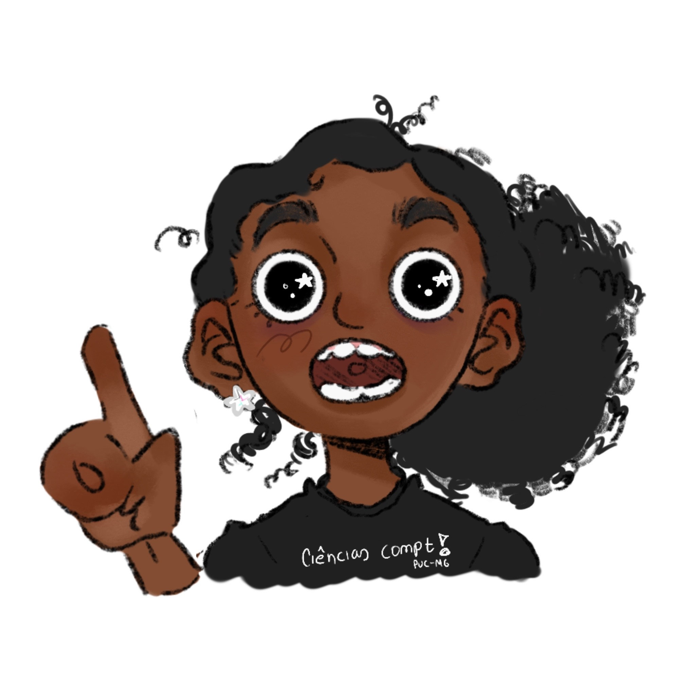

<h1 align="center">*・°☆.。*・☆𝐒𝐞𝐣𝐚 𝐛𝐞𝐦-𝐯𝐢𝐧𝐝𝐨 (𝐚) 𝐚𝐨 𝐦𝐞𝐮 𝐩𝐞𝐫𝐟𝐢𝐥!*・°☆.。*・☆</h1>

##

##
  <h2 align="center">*・°☆.。*・☆Olá Leitor!!*・°☆.。*・☆</h2> 

   <p2>Seja muitíssimo bem vindo ao meu perfil aqui no Git!! Aqui é um ambiente acolhedor, então sinta-se à vontade para ver meus repositórios.</p2>
  <p3> Vamos a uma breve apresentação sobre a minha pessoa!!</p3>

<article><ul>
   - Meu nome é Gabriella, mas eu prefiro que você me chame de Gabi :)  
   - Aualmente eu tenho 19 anos e estou cursando o primeiro período de Ciências da Computação na PUC-MG  
   - Estou me descobrindo nessa área de computação!! Digo me descobrindo porque quando eu sai do ensino médio eu queria fazer medicina, então estar nessa área é literamente me redescobrir  
   - No meu tempo vago eu sou artista!! Amo desenhar (Inclusive todos esses que vocês vêm no meu perfil foi eu mesma que fiz 🤓 )
   - E até um tempo atrás eu era meio nerd! Gosto de animes, mangás e cartoons, embora agora eu não tenha mais tanto tempo para me dedicar assistir  
</ul><article>

